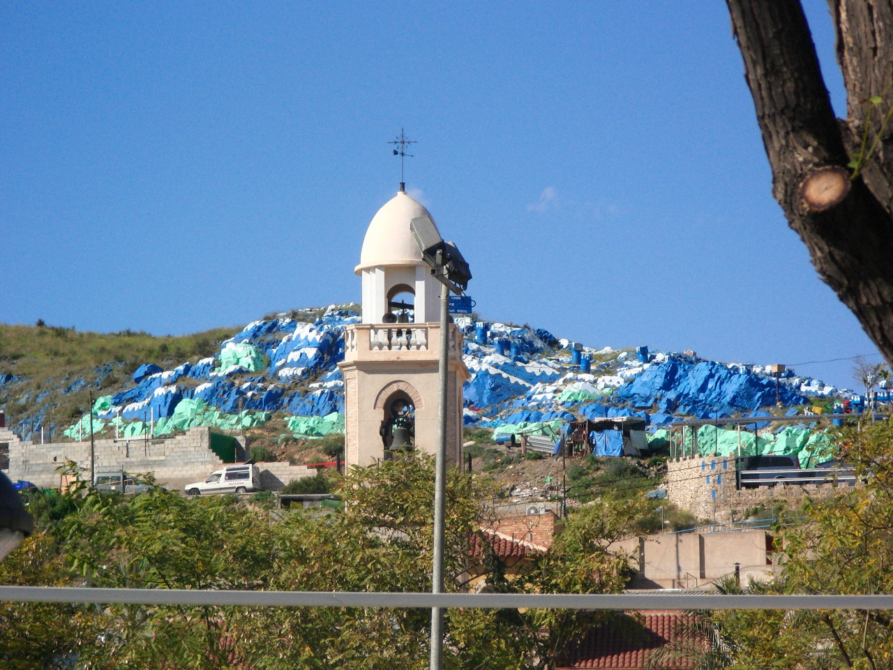
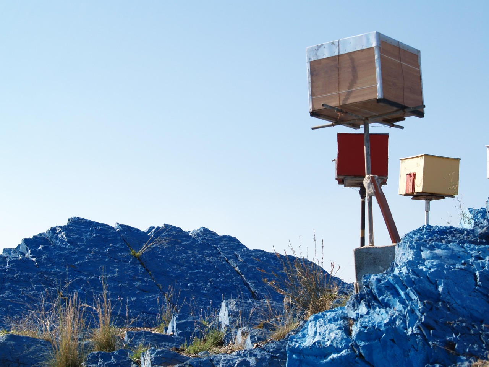

---

> Pero... Mi verdadera identidad, ¡es Jesucristo!
> 
> Aunque no me podéis creer.
> 
> \- Diego el Profeta

---

En la pedanía de Cabezo de Torres, al norte del municipio de Murcia (España), se encuentra una obra de arte; deteriorada e ignorada, pero de arte.

Es conocida como la Montaña Azul, por motivos obvios.

Su autor fue Diego López, alias El Profeta, protagonista de este artículo. 

Nació el 28 de agosto del 1964, creció en Cabezo de Torres junto a su hermano Matías y a su madre Asunción, a quien no tenía mucho aprecio. Su padre falleció a los pocos meses de nacer.

---

Fuentes:
* Imágenes 
  * [monte00.jpg](https://ucmedia.er2.co/es/corner-main/50/960/9999.jpg?1585932239)
  * [monte01.jpg](https://blogger.googleusercontent.com/img/b/R29vZ2xl/AVvXsEipoFrBYhu19lANG6zNsx7klf2mYWINm4h2Ht55lJ8eYtpjaf4fwkPIgxd5A5YUWLyEdRFjYekMh9YsE5QbxDWMpmY-y8N4_VQDdQVtFlvlOEu3Kp5f87s_EyPWbVE6lKOsMUEnRsGUNd8/s1600-h/200807200807_26688400-original.jpg)
* Documentos
