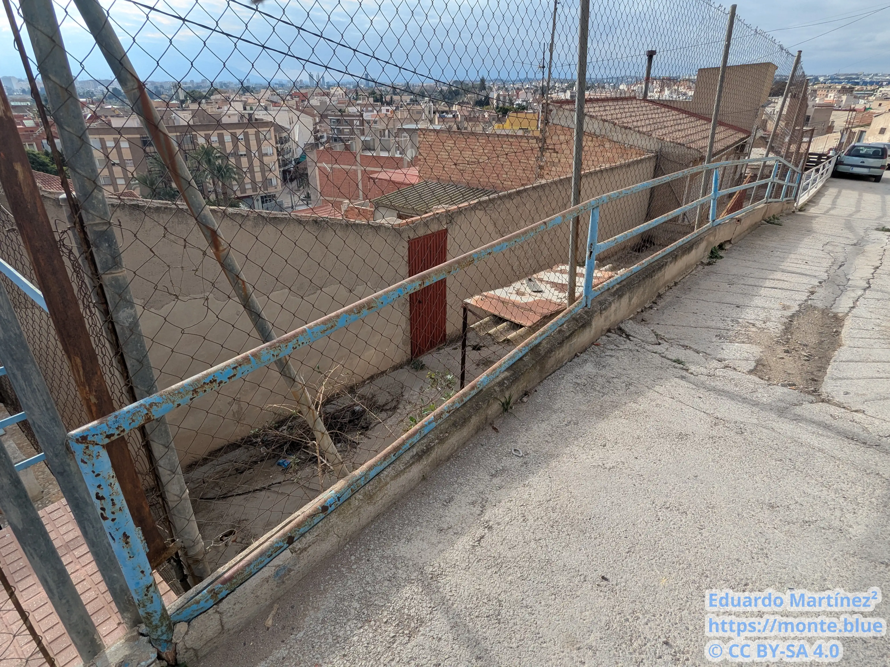

---

> Pero... Mi verdadera identidad, ¡es Jesucristo!
>
> Aunque no me podéis creer.
>
> \- Diego el Profeta

---

# El arte cabezotorrense

En la pedanía de Cabezo de Torres, al norte del municipio de Murcia (España), se encuentra una obra de arte; deteriorada e ignorada, pero de arte.


<iframe src="https://www.google.com/maps/embed?pb=!1m18!1m12!1m3!1d1153.0178408463842!2d-1.1230390104522872!3d38.025645151007396!2m3!1f0!2f0!3f0!3m2!1i1024!2i768!4f13.1!3m3!1m2!1s0xd6383cf70524ccd%3A0x9b46fd6cf613d349!2sLa%20Monta%C3%B1a%20Azul!5e1!3m2!1sen!2sie!4v1737411298078!5m2!1sen!2sie" width="600" height="450" style="border:0;" allowfullscreen="" loading="lazy" referrerpolicy="no-referrer-when-downgrade"></iframe>


Es conocida como la Montaña Azul, por motivos obvios.

")

")

Fue pintada por Diego, vecino de la pedanía. Comenzó en 1999 hasta 2003, a lo que siguió un parón de cinco años hasta 2008 cuando Diego volvió para añadir, entre otras cosas, el color blanco para simular unos picos nevados.

")

")

Si contamos toda la extensión del montículo, aunque hayas partes más decoradas que otras, ocupa aproximadamente 9920 metros cuadrados. Se encuentra en el barrio del Cabezo de la Cruz. Al encontrarse en lo alto de una colina, añadido que Murcia está en un valle, se puede ver desde bien lejos, por ejemplo desde la rotonda de los cubos de Murcia se ve con claridad.

")

")

No solo pintó la montaña, también decoró muros, rejas, canaletas, etc.

Me pasé en diciembre del año pasado a fotografiar la zona, como muestro a continuación. El paso del tiempo y la total dejadez de las administraciones ha propiciado la erosión de muchas partes de la obra.

")

")

")

")

")

")

")

")

")

Como habrás podido apreciar, la obra emana una aura mística, con el dibujo de crucifijos, el aspecto relativamente medieval o la representación de los planetas.

Todo esto fue a propósito, tiene una razón de ser, pero para poder entender la iconografía primero hay que hablar de su autor, Diego, conocido y autodenominado _El Profeta_.

# Un artista marginal

El autor de esta obra fue Diego López Martínez, alias El Profeta, protagonista de este artículo.

Nació el 28 de agosto del 1964, creció en Cabezo de Torres junto a su hermano mayor, Matías, y a su madre, Asunción. Su padre, también Matías, falleció en un accidente de moto a los pocos meses de nacer.

")

¿Cómo sé todo esto? Fácil, porque escribió [gran parte de su vida en un blog](https://diegoelprofeta.blogspot.com/2009/05/el-por-que-pinte-una-montana-de-azul.html). Es bastante extenso (tiene 24609 palabras). Aquí iré resumiendo los detalles más interesantes de su vida, intercalando con citas del mismo texto y documentación que he ido recopilando.

Asistió al colegio Salesianos del pueblo como medio pensionista. Participaba en las misas del pueblo como monaguillo.

Ya desde pequeño Diego era un poco pirata... Con seis años robó junto a su hermano una bicicleta en el colegio, cuando participaba de monaguillo le robó una vez el dinero al párroco, con 11 o 12 años se escapó en bici con su amigo Tino a Mazarrón, harto de los desencuentros en casa, pero volvieron en coche cuando el padre de Tino les encontró...

Sobre la misma edad se echó su primera novia, _una tal Juani_, empezó a frecuentar salones recreativos, discotecas, bares, etc., a juntarse con _los más golfos de su pueblo_; en fin, empezó su camino hacia una vida quinqui, llena de vaivenes. Su madre, ante la imposibilidad de domarlo, lo puso a trabajar de albañil.

También sobre esta edad, importante señalar que tendría 12 ó 13 años, tuvo sus primeros contactos gays, bastante cuestionables, ya no solo por su precocidad, sino especialmente porque era con hombres adultos, los cuales le pagaban a cambio de tocarse frente a ellos... Prueba de que son adultos es que uno dirigía una relojería:
> [...] el primero fue con la relojera, un gay que tenía una relojería y entonces me llevaron el picha gorda y su cuñado para que me la tocase y me daba dinero [...]

Por terrible que sea que unos adultos se aprovechen de la inocencia y marginalidad de este niño, así fue como Diego conoció su bisexualidad. Luego comenta que para seguir consiguiendo dinero, visitaba el Jardín de Floridablanca y ejercía de chapero. A partir de aquí empezó a frecuentar locales de ambiente gay en Murcia.

Me voy a desviar un momento de la historia de Diego con lo siguiente. En estos locales de ambiente se juntaba, entre otros, con una tal Menchu, como dice a continuación.

> Esta tal Mónica iba con una travesti más, se llamaba Menchu y así fuimos entrando en un circulo gay en Murcia en general, pubs, discotecas, etc….

Menchu, de Murcia... Quien tenga algo de cultura española televisiva igual ha adivinado quién es. Salió en Callejeros. Es toda una diva, tiene mucho estilo.


<iframe width="560" height="315" src="https://www.youtube-nocookie.com/embed/FN2-SbuY1_s?si=pLGuxcF_FSoebIdt" title="YouTube video player" frameborder="0" allow="accelerometer; autoplay; clipboard-write; encrypted-media; gyroscope; picture-in-picture; web-share" referrerpolicy="strict-origin-when-cross-origin" allowfullscreen></iframe>


Investigando un poco más sobre ella, di con una entrevista que le hicieron, dividida en dos vídeos.


<iframe width="560" height="315" src="https://www.youtube-nocookie.com/embed/CwLn0S5wY6A?si=FXz7pDLsY9q0ToER" title="YouTube video player" frameborder="0" allow="accelerometer; autoplay; clipboard-write; encrypted-media; gyroscope; picture-in-picture; web-share" referrerpolicy="strict-origin-when-cross-origin" allowfullscreen></iframe>



<iframe width="560" height="315" src="https://www.youtube-nocookie.com/embed/3X9PXA6Kc6I?si=8MZT6aJdh1DXl8if" title="YouTube video player" frameborder="0" allow="accelerometer; autoplay; clipboard-write; encrypted-media; gyroscope; picture-in-picture; web-share" referrerpolicy="strict-origin-when-cross-origin" allowfullscreen></iframe>


El último registro con el que he dado sobre ella es del 12 de marzo de 2022, me alegra saber que está bien. Es sobre unos trabajadores de Cabify que la reconocieron y se grabaron con ella.


<iframe width="580" height="1031" src="https://www.youtube-nocookie.com/embed/4uirztsuumk" title="La Menchu de Murcia #humor" frameborder="0" allow="accelerometer; autoplay; clipboard-write; encrypted-media; gyroscope; picture-in-picture; web-share" referrerpolicy="strict-origin-when-cross-origin" allowfullscreen></iframe>


Diego, tras conocer a Menchu y compañía, fue a Mallorca un tiempo. A partir de este momento en muchos puntos de su vida se dedicó a vagar por España buscando ocio y diversión, acompañado de drogas e infortunios...

> Y la vida de siempre, fumábamos porros, nos comíamos algún tripi de vez en cuando y empezamos con la heroína, un gran problema, en fin.

Diego intercala entre la narración de su vida valoraciones sobre lo que él consideraba _energía negativa_ y _energía positiva_.

> Bueno aquí ya estaba actuando la energía negativa, en mi para que yo no me manifestara, me echaba del pueblo y me tenía fuera del pueblo en otras regiones muy lejos de mi pueblo, también la energía negativa actuaba en mi metiéndome endrogas, alcohol, etc…

Para él, la negativa era la vida de drogas y desmadre, incluido las personas del ocio nocturno pero también cualquiera que se pusiera en su camino y le llevase mínimamente la contra. Tiene especial fijación por tachar a las mujeres de _energía negativa_, entre otras cosas por la relación tormentosa que tenía con su madre por su estilo de vida (el de él, por supuesto), pero también por las revelaciones que le llevaron a pintar la montaña azul, la obra que nos atañe en este artículo. La positiva, por contra, era todo lo que no era energía negativa, en resumidas cuentas, el pintar la montaña e ir sobrio.

Uno de los relatos más impactantes fue su relación con Ascen. A la pobre Ascen le ocurrió lo siguiente...

> [...] con una novia que se llamaba Ascen, estos gitanos nos llevaron a la Cresta del Gallo y me amenazaron para que se lo hicieran con esta chica y yo cedí y se la follaron todos y entonces me volvieron a amenazar para quedar otro día [...]

Luego marcharon a Zaragoza tras este terrible suceso, rompieron al poco de desplazarse.

Salió en esta ciudad con otra chica, Sara, quien tras una noche de borrachera, volvieron a dormir a su refugio, un edifico a medio construir, y la chica se precipitó por el hueco del ascensor, partiéndose el cráneo y falleciendo en el acto.

Diego aseguró en comisaría y en su historia que no fue su culpa, y que tras esto empezó a tener ataques epilépticos, cada pocos meses, durante años, los cuales le dejaban hecho polvo. Ya a estas alturas, uno se hace la idea del contexto que le llevó a pintar una montaña de azul mientras se autodenominaba _el profeta_.

Hasta los dieciocho fue vagando de ciudad en ciudad, conociendo personas como él, haciendo amigos adonde fuera. Una vez alcanzó los 18, empezó la mili en León, aunque duró poco tras ser encerrado en calabozo e intentar cortarse las venas. Consiguió la exención total.

> Ya entrando en la juventud, estaba hecho una pena, sin dientes, me faltaban algunos, con cicatrices en todo el cuerpo y enganchado a la heroína, barbitúricos y demás, desequilibrado total.

Un tiempo después, el jefe de su madre Asunción y Don Pedro, un sacerdote del Salesianos, le convencieron para internarse en un centro de desintoxicación. Le sirvió durante un tiempo. Viajó tanto por España como por Portugal (Santa Margarita, después en Aveiro, Torres Vedras, etc.). Hacía terapia de grupo y lo tenían entretenido. Allí descubrió que se le daba bien vender libros.

Con 23 años fue a Alicante, con lo de los libros consiguió un poco de estabilidad, hasta se desenganchó de las drogas un tiempo, pero volvió a caer, así una y otra vez a lo largo de su vida...

Volviendo de _Terapia_, un local de la carretera de Madrid en Alicante, tuvo un accidente de coche, se salió una rueda y el coche dio vueltas de campana. Él asegura que salió ileso, cosa que entendió como que _algo importante en la vida tenía que hacer_.

Estaba en todo el meollo de la _Ruta del Bakalao_, que la describe poéticamente de la siguiente manera:

> Todo esto claro lo hacía el universo, bueno, ahí estaba en la Ruta del Bacalao, la crucificación de esta época para los verdaderos hijos de la luz, a base de pastillas, música y mujeres endemoniadas.

Tiempo después volvió a rehabilitación, esta vez por menos tiempo, cosa que desagradó a su madre y a su hermano. Diego con ellos mantenía disputas, y Diego les recrimina en muchas ocasiones que las dos viviendas en la calle de la Virgen y la calle de la Cruz están a su nombre.

A estas alturas conoció a Susi, madre de sus dos hijos, Óscar, el mayor, y Noel, el menor. Hasta tuvo un periodo de cierta estabilidad por cinco años:

> Bueno, entonces de nuevo a Alicante me presenté en la misma editorial y a vender libros, pero hay estaba uno de mis mayores barreras para manifestarme. Susi, la mujer que tuve dos hijos con ella y me intentó manipular y llevó mi energía, durante los cinco años siguientes, entonces ya tenía veintiocho años cuando esto.

Empezaron a convivir juntos porque Diego le pidió que le alquilase una habitación. Trabajaban vendiendo libros. Luego, como a ambos les gustaba mucho la fiesta, iban juntos a discotecas, donde empezaron a congeniar. Se acabaron mudando al piso de ella en Santa Pola y se casaron en Elche.

Los años pasaron, Diego empezó a agobiarse por la relación, y ninguno de los dos tenían muy buenos hábitos en cuanto a drogas se refiere.

> [...] a ella no le gustaba las pastillas (éxtasis), ni el Speed, entonces comprábamos cocaína, que es lo que a ella le gustaba y de esta manera la fiesta la montábamos juntos en casa, con nuestros juegos eróticos y alcohol. Así nos fuimos metiendo en esa sustancia al máximo, meses tras meses y lógico todo se fue al traste, pues el dinero era todo para lo mismo.

Finalmente se separaron un tiempo, Diego se fue a vivir con su madre Asunción.

Ahora viene lo bueno. En este preciso instante, Diego tuvo la revelación que le hizo empezar a creer que era algún tipo de divinidad, hasta llegar a la conclusión de que él era el mismo Jesucristo. La experiencia merece ser leída tal cual Diego lo redactó.

> Entonces allí tuve mi primera revelación de la divinidad, estuve con una amiga de fiesta, Reme, que esta chica también intentaba anteponerse en mi misión, por medio del universo. El caso es que al separarme de Susi, ella apareció para introducirse en mi manifestación. Estuvo conmigo durante unas semana y un día fuimos a la Cresta el Gallo, donde Dios se me manifestó claramente en formas de nubes que en un vídeo de Antena 3 y en Internet, montaña azul, lo explico. Me dijo con dibujos claros que yo tenía que destruir a la energía negativa, primero con la figura de él, Dios, en las nubes como lo pintó la Iglesia Católica, con su rostro y durante tres minutos, algo muy claro. Seguidamente se deshicieron, esas nubes y se transformaron en el mismo rostro, expulsando un soplido de la boca y enfrente destruyendo la imagen de un demonio. Esto también duró unos tres minutos y seguidamente las imágenes se deshicieron y volvió a transformarse enfrente de nosotros, la imagen de Dios con el puño alzado como diciendo fuerza.

No dudó en contar lo que vio, a lo que su madre le dijo _¡calla loco!_ Pero Diego nunca olvidó esta visión, empezó a _detectar_ señales, indicios de que él era el mesías.
Volvió con Susi ya que nació Noel; lo dejaron, volvió a la fiesta... En una ocasión, en casa de su amigo Jesús de Orihuela, hasta la televisión le transmitió mensajes.

> Al principio me quedaba en su casa viendo películas en el vía satélite, donde me comunicaba con las películas, que cada película era una explicación de mi misión en la vida. Algo un tanto difícil de entender para las personas normales.

Poco a poco se fue dando cuenta de quién era realmente... Hasta un día que trabajando de albañil en la reconstrucción del palacio episcopal de Orihuela, tuvo una experiencia de éxtasis religioso, era capaz de recibir información telepática y sentía un bienestar fuera de lo normal.

En este estado, anduvo hacia el monasterio de los Franciscanos, vio claro que era Jesucristo y partió rumbo a Murcia.

> Sumido en mi éxtasis natural, a los minutos de estar allí, recuerdo, un franciscano que me dijo que me pusiese en el otro altar que tienen el Cristo, yo no lo sabía y cuando me arrimé al otro altar y ví al Cristo fue algo increíble, pues ví mi cara reflejada en la del Cristo. Después de tal consolación y sentir esa gracia tan especial divina marché para afuera con dirección a Murcia, andando por los caminos de huerta, en un estado de gracia plena.

De camino a Murcia, cogió un saco donde fue echando peso, con verduras, patatas, melones; y se lo echó al hombro, haciéndole sentirse Jesucristo en la penitencia. A su vez, recibía mensajes telepáticos que le insistían en seguir la ruta del penitente a su cruz, en la que sería la futura montaña azul.

Fue vagando por los campos de Murcia, su bellísima catedral, el hotel Churra..., añadiendo peso a su cruz, mientras tenía sentimientos de _miedo, pasión y agonía_.

Entonces, empezó a pintar. Primero, un cartel de hojalata, de fondo negro y el texto INRI en azul, que fue colgado en la cruz del Cabezo. Luego pintó con pintura _azul luminosa_ encima de _lo negro_ de las paredes de su barrio. Todavía no había pintado el monte. Fue por este momento cuando empezó a ir a misa y a tener problemas, tanto con los asiduos de la iglesia por interrumpir la misa como con los vecinos por motivos diversos.

> Fueron pasando los meses y por el día luchaba en mi barrio, creando paredes nuevas, con piedras y pintadas azules y por la tarde a la misa [...]
>
> Desde el 2000 hasta el 2003 tuve peleas, denuncias con los vecinos y también con las feligresas y el párroco que les sabía mal mi gran devoción y mi gran tono de voz a la hora de cantar o contestar en las plegarias.

Arregló y decoró su casa con motivos religiosos, pintó las verjas, la puerta, unas cruces, montó un altar y cerró enfrente de su casa con piedras que recogió de la montaña para evitar que aparcaran, esto último causó fricciones con los vecinos.

> [...] las familias gitanas de mi barrio, que me amenazaban y tenía peleas constantemente, una vez la señora con la goma de regar me intento ahorcar y yo les denuncié [...]

En la iglesia, hubo un momento en el que el cura no quiso dar la comunión a Diego por ir en bermudas. Diego se ofendió tanto que contactó con la presa para denunciarlo públicamente. Contactó con La Verdad y La Uno. Desafortunadamente, no he podido encontrar las noticias que cubrieron esto, solo está mencionado en la historia. Al final el cura dio su brazo a torcer y Diego pudo tomar la comunión.

Mientras tanto, siguió con su obra. Tras haber pintado cerca de su casa, construyó los muros de piedra de alrededor de la montaña, a petición del bar Las Cumbres, entonces siguió decorando y pintando de azul, color que repele la energía negativa, hasta que se le ocurrió pintar piedras del monte.

> Todos los días de alcaldía iba a hablar con el alcalde de lo que estaba haciendo, muros de contención, pintando las barandillas y demás, también le dije que iba a hacer alguna obra de arte en el monte.
>
> [...] en el juego de bolos de el bar Las Cumbres, todo con mi dinero de una pensión por minusvalía hice un castillo, piedra a piedra recogidas todas del Cabezo.
>
> Ese castillo yo energéticamente le hice ventanas, saetas y huecos por donde se disparaba en la Edad Media.
>
> Estos huecos fueron pintados de color azul, el color que destruye a la energía negativa, [...], entonces pinté todo, el peñasco llamado piedra recuyente, en este peñasco nos tirábamos de pequeños en forma de tobogán, empecé a las 6:00 de la mañana y entre paletinazos del 33, arriba y abajo, hasta la hora de la misa, un día, otro día y al final en una semana el monte, se veían una manchita azul.

Con la pintura de las piedras surgió la alarma, tanto como para avisar a la policía. Tras hablar los agentes y Diego, avisaron al alcalde, Manuel López, y al administrador porque según el artista este le había dado permiso. El alcalde le preguntó hasta dónde pintaría y le dejó hacer lo que le dijo. A Diego le pareció irónico que a toda esta gente le molestara las pintadas y el supuesto deterioro del monte pero no que el monte estuviera lleno de basura y escombros.

Entonces, La Opinión de Murcia escribió un artículo sobre el suceso, un hombre estaba pintando el monte _porque decía que veía al diablo_ (no he podido encontrar dicho artículo). Esto fue el detonante para que otros medios de comunicación se pasaran también a documentar el hecho y entrevistarse con su autor.

En Antena 3:


<iframe width="560" height="315" src="https://www.youtube-nocookie.com/embed/qzEvdwIBpo4?si=Jm4x20OBkjZ-kx7w" title="YouTube video player" frameborder="0" allow="accelerometer; autoplay; clipboard-write; encrypted-media; gyroscope; picture-in-picture; web-share" referrerpolicy="strict-origin-when-cross-origin" allowfullscreen></iframe>


En Telecinco:


<iframe width="560" height="315" src="https://www.youtube-nocookie.com/embed/DcxwqD9PDPY?si=BikIBaH1h0BnaYrT" title="YouTube video player" frameborder="0" allow="accelerometer; autoplay; clipboard-write; encrypted-media; gyroscope; picture-in-picture; web-share" referrerpolicy="strict-origin-when-cross-origin" allowfullscreen></iframe>


En TV1:


<iframe width="560" height="315" src="https://www.youtube-nocookie.com/embed/ttKSzMR94-w?si=fI4smRySHcUXWt6g" title="YouTube video player" frameborder="0" allow="accelerometer; autoplay; clipboard-write; encrypted-media; gyroscope; picture-in-picture; web-share" referrerpolicy="strict-origin-when-cross-origin" allowfullscreen></iframe>


En TVM, dividido en dos partes:


<iframe width="560" height="315" src="https://www.youtube-nocookie.com/embed/ctaHc-JzPMk?si=viNEAVeSyr9RgPfv" title="YouTube video player" frameborder="0" allow="accelerometer; autoplay; clipboard-write; encrypted-media; gyroscope; picture-in-picture; web-share" referrerpolicy="strict-origin-when-cross-origin" allowfullscreen></iframe>



<iframe width="560" height="315" src="https://www.youtube-nocookie.com/embed/T4Cs83ZyKLw?si=5e63A2fOefgwmdQt" title="YouTube video player" frameborder="0" allow="accelerometer; autoplay; clipboard-write; encrypted-media; gyroscope; picture-in-picture; web-share" referrerpolicy="strict-origin-when-cross-origin" allowfullscreen></iframe>


Por último, se menciona una entrevista en Crónicas Marcianas que no he podido encontrar.

Todas estas entrevistas ayudaron a mejorar la imagen de Diego en el pueblo, algo que él tachó de hipocresía porque antes de esto poca gente le valoraba y se metían con él. Mientras tanto, él siguió decorando, entre peleas con las feligresas por interrumpir la misa y con los vecinos por otros motivos.

> [...] yo seguía con mi misión [...] Pues con carretilla, recogiendo piedras y piedras, seleccionándolas, lavándolas, etc..., hice al pie de la cruz escalones con piedras y tres nubes, en dibujo en los escalones, donde puse tres frases, una en cada nube.
>
> Ama, para que seas amado.
>
> Respeta para que seas respetado.
>
> Y la más importante: Os estoy juzgando y los tres ceros que tiene esta frase, uno en cada frase, marcan el 2000, año en que Dios me hizo juzgar a la humanidad, sin contar el número dos.
>
> Y alrededor de la cruz puse nubes de escayola, [...] todo una obra de arte, hecha por el propio Jesucristo para que algún día me creáis.
>
> También hice un camino de piedras, desde el bar, Las cumbres, hasta la cruz, yo la energía de Dios y una carretilla.

A raíz de todo el bombo, el artista empezó a recibir ayudas por parte del ayuntamiento y de algunos locales. Aparte, un gran beneficiado de esta obra fue el dueño del bar de Las Cumbres, que con la viralidad de los reportajes atrajo a muchos curiosos que paraban a tomar algo ahí. Asimismo, Diego le reconstruía las paredes gratis, porque formaban parte de su castillo.

Una anécdota que recuerda con resentimiento es que Asunción, su madre, impedió que cenase con la familia en Nochebuena; le daba una bolsa de carne para que se la asara él solo. Los problemas familiares eran palpables, existían tales tensiones como para que también tabicara el acceso entre las dos viviendas de la familia, la de la Calle de la Cruz, ocupada por Diego, con la de la Calle de la Virgen, de su madre y hermano.

Me gustaría resaltar otra cita. Intento ceñirme a la narrativa de su vida, saltando un poco sus reflexiones metafísicas, pero este texto me resulta poético:

> Como hace 2000 años cuando fui el Jesucristo del pasado, yo era el loco y el que se proclamaba hijo de Dios, eso era una blasfemia, por esto me crucificaron en una cruz. Pero en esta época, me han estado crucificando durante años a base de drogas y todo el enrollo que conllevaba, eso es la crucificación de hoy en día, la gente cree que los sacerdotes, monjas, políticos y empresarios son el bien y los delincuentes, gays, drogadictos, etc…, son los malos, pues os digo que es todo lo contrario, pues el mal está instalado en la tierra y por supuesto quien va a triunfar en la vida no van a ser los buenos, sino los malos, transformados en buenos.
>
> El reino de Dios, es de los drogadictos, delincuentes y gays, y la Iglesia Católica es la mayor organización negativa, que está en contra, de Jesucristo, positivo y a favor de María, negativo, que es el demonio, ellos no lo saben, ellos creen que está bien, pero el demonio es mas astuto que el catolicismo por esto se introdujo, por María, porque él demonio, es la mujer y la representante de la mujer es María.

Mientras tanto, los problemas en la iglesia siguieron. Diego seguía molestando en las plegarias, algo que incomodaba a las feligresas y al párroco, tanto que llegaron a celebrar misa evitando que Diego se enterase, o a avisar al sargento de la Guardia Civil para que le llamase la atención, o quejarse al alcalde, Manuel López. Al final consiguieron amedrentarle recogiendo firmas para encerrarle en un psiquiátrico. Solo recogieron firmas, no es que consiguieran el propósito o si es legal acaso, pero esto preocupó a Diego tanto como para que decidiera marcharse de nuevo por España sobre febrero del 2003, no sin antes quitar las puntas nevadas de la montaña azul, entiendo que por el disgusto que llevaba con la situación.

En total su estancia en Cabezo de Torres fueron tres años seguidos donde Diego se dedicó a su labor creativa, sin consumir ningún tipo de sustancia estupefaciente, lejos de la energía negativa, es decir, la vida de fiesta y desenfreno. Todo esto acabó cuando se fue a los carnavales de Cádiz.

> Después de mas de tres años sin consumir nada de alcohol, ni drogas, para relacionarme en esta sociedad, comencé de nuevo, a fumar y tomar de todo, así me pasé unos carnavales de maravilla, pero cuando me drogaba me entraba la energía negativa en la mía limpia y transparente haciéndome mucho mal.
>
> Pero así funciona el universo, a veces, te dirige la energía positiva y otras veces, cambia a la negativa [...]

En Cádiz volvió a encontrarse con viejos amigos de cuando estuvo vagando por el país. Después de Cádiz fue a Granada, asistió a un festival llamado el Dragón, celebrado en medio de las Alpujarras granadinas. Luego le siguió Navarra con los San Fermines, tras esto Lugo y de vuelta a Granada.

En Lugo conoció a una chica llamada Mónica, que tenía algún tipo de trastorno mental y era hipersexual. Con Diego era muy estricta en la cama, ella debía _tener tres orgasmos por cada corrida suya_. Esta chica se fue a estudiar veterinaria a Las Palmas. Como Diego estaba colado por ella, se fue a visitarla, hasta que en Fuerteventura vio que le pasaba algo raro. Sin mediar palabra le metía la mano al paquete de un amigo que ahí estaba, o salió a la carretera desnuda, metiendo mano a todos los hombres a su paso... Al final tuvieron que buscarla a un restaurante y avisar a una ambulancia para que la trataran.

A todo esto, le embargaron la casa de la calla de la cruz, por una deuda con la Seguridad Social. Del embargo recibió 1500 euros que sobraron. Discutió con su madre Asunción por teléfono por este asunto.

En Granada dormía donde podía, o bien en casas de amigos, en albergues, o hasta en la calle. Tras esto fue a Ibiza, alternando con viajes a Formentera. En un momento dado, se fue a Tenerife, donde recibió un encargo divino un tanto peculiar.

> Me instalé en el camping caravanig [...] yo me dedicaba a ir a las galletas todos los días a misa, sin falta, cantando como lo hacía en la parroquia de el Cabezo de Torres [...] entonces tuve una serie de comunicaciones o mensajes que me decían que tuviese relaciones sexuales con hombres [...] en las calas donde se ligaba con gays de esta forma empecé a tener relaciones sexuales con hombres cada vez mas [...] sentía placer tanto o más que con una mujer [...]

A partir de este punto ya viajaba sin parar por España. En algún momento viajó a Tudela por encargo a pintar un salón dentro de un bar, donde hizo el universo en piedra, como el de la montaña azul. También pegó por Tenerife carteles del monte azul.

Entre fiestas, drogas y sexo, en algún momento enfermó de VIH. Llegó a estar hospitalizado en el hospital de la Candelaria o el de La Laguna.

Finalmente decide volver a Murcia, donde discute con su madre y su hermano por los problemas de la vivienda. Ahí también decide visitar a sus dos hijos, Óscar y Noel. Ambos se encontraban en un correccional de Alicante, aunque solo pudo ver a Noel. Según la madre, ambos fueron enviados ahí por mala conducta con la familia. Es una lástima ver lo que una familia desestructurada puede acarrear a los hijos.

Las Cumbres volvió a pedir pintar todo el techado del aparcamiento:

> Bueno, con la pensión y un trabajo de pintura que me ofreció el Tostones, dueño del bar Las Cumbres, para pintar todo un techado, era el antiguo juego de bolos, hoy aparcamiento del restaurante fui tirando.

Tras el aparcamiento, volvió a pintar la montaña. Repintó las cumbres de blanco y añadió un tercer color verde:

> Entonces seguí pintando también parte de azul que estaba descolorido e hice unas franjas de verde en la parte de abajo, así formaban tres colores, aunque el que predomina es el azul, [...]

En esta ocasión también vinieron medios de comunicación, como La Verdad, La Opinión, La Sexta, 20 Minutos, Agencia Efe o la 7 Región de Murcia. Solo de estos dos últimos pude encontrar información, como estos tres artículos de 20 Minutos: [uno](https://www.20minutos.es/noticia/366307/0/cabezo/torres/azul/), [dos](https://www.20minutos.es/noticia/373216/0/monte/azul/murcia/) y [tres](https://www.20minutos.es/noticia/373753/0/monte/cabezo/pintura/).

En la agencia EFE:


<iframe width="560" height="315" src="https://www.youtube-nocookie.com/embed/x53hkLRt0q4?si=MR_C0ptt-EugmOea" title="YouTube video player" frameborder="0" allow="accelerometer; autoplay; clipboard-write; encrypted-media; gyroscope; picture-in-picture; web-share" referrerpolicy="strict-origin-when-cross-origin" allowfullscreen></iframe>


En 7 Región de Murcia, he encontrado dos entrevistas:


<iframe width="560" height="315" src="https://www.youtube-nocookie.com/embed/OK0PlZROD4Y?si=DCAjfmJ0A6x1Xt73" title="YouTube video player" frameborder="0" allow="accelerometer; autoplay; clipboard-write; encrypted-media; gyroscope; picture-in-picture; web-share" referrerpolicy="strict-origin-when-cross-origin" allowfullscreen></iframe>



<iframe width="560" height="315" src="https://www.youtube-nocookie.com/embed/Vk8O_eLhHLs?si=PMz-5EJmPrt9EdK9" title="YouTube video player" frameborder="0" allow="accelerometer; autoplay; clipboard-write; encrypted-media; gyroscope; picture-in-picture; web-share" referrerpolicy="strict-origin-when-cross-origin" allowfullscreen></iframe>


Tuvo problemas de dinero para financiar la obra, así que con la ayuda de la prensa y la televisión recabó algo de dinero que le ayudó en su cometido. También pidió financiación imprimiendo unos _trípticos informativos_, los cuales dejaba en hoteles de la provincia.

Viajó durante más de tres meses por Murcia y luego por pueblos de España para dar entrevistas y publicitar su obra. Me gustaría resaltar esta cita donde habla sobre su satisfacción al ver que era valorado por pintar la montaña.

> Todo esto, yo solo apoyado por algún lado con algunos donativos de gente a favor de mis actuaciones en la región de Murcia, me trataban con mucho cariño y muy interesados de el porque lo pintaba y que siguiera adelante que el ochenta por ciento me apoyaba y me apoya, eso para mi fue muy gratificante, pues yo al principio creía que me iban a matar por pintar un monte y es todo lo contrario, han visto que he hecho algo único en su Tierra, en nuestra Tierra, y al mismo tiempo que soy un personaje especial murciano.
>
> Todo esto es lo que yo a lo largo de unos meses tratando el tema con ellos me transmitían algo que les gustaba, algo único y en su Tierra, como si fuese algo muy especial y me sentía familiar, pues casi todo el mundo me había visto o leído de alguna forma, sabían de mi obra y mi existencia por esto, había un trato como familiar, pero no como mi familia ni mucho menos, familiar en general

De repente, volvió a tener otro asalto de la energía negativa que le llevó a Granada, luego a Cádiz, y finalmente a Tenerife, lugar donde termina esta narración.

En Tenerife pensó en si marchar a tener una vida asceta en la India, o quizá en algún monasterio de por ahí, pero finalmente se asentó en una cabaña en la Montaña Roja de Tenerife, donde pasó los días y se dedicó a subir vídeos a YouTube.


<iframe width="560" height="315" src="https://www.youtube-nocookie.com/embed/YoODW4su6X0?si=uPHz7uGHkMb2dZNs" title="YouTube video player" frameborder="0" allow="accelerometer; autoplay; clipboard-write; encrypted-media; gyroscope; picture-in-picture; web-share" referrerpolicy="strict-origin-when-cross-origin" allowfullscreen></iframe>


Pasó el resto de sus días en Tenerife, falleció sobre el 2013 ó 2014, en soledad, lejos de su familia y de su obra, como [explica el obituario de La Opinión de Murcia](https://www.laopiniondemurcia.es/comunidad/2017/05/07/adios-profeta-montana-azul-31892078.html). Hasta aquí está documentada la vida de un auténtico _personaje especial murciano_ como fue Diego.

# Un gran archivo documental

Llegados a este punto, debería hablar de todas las fuentes. Realmente merece su propio apartado, dada la ingente cantidad de información disponible sobre la obra. Uno se hace la idea ya con todo lo redactado anteriormente, pero me gustaría enseñar, primero de todo, la imagen de a continuación, un cartel que escribió el mismo Diego.

")

Como bien explica el cartel, escribió [su vida en un blog](https://diegoelprofeta.blogspot.com/2009/05/el-por-que-pinte-una-montana-de-azul.html), pero también subió más de 900 vídeos a YouTube en, hasta donde he podido indagar, dos canales y uno más que tengo dudas.

[Su primer canal](https://www.youtube.com/@diegoelprofeta3). Aquí empezó a grabarse en su día a día, predicando la palabra de Dios. Sospecho que perdió la contraseña del canal por lo que dejó de subir aquí. Por ejemplo este es su quinto vídeo.


<iframe width="560" height="315" src="https://www.youtube-nocookie.com/embed/2_xBXOfUZB0?si=COz1wIozzNE3qA1I" title="YouTube video player" frameborder="0" allow="accelerometer; autoplay; clipboard-write; encrypted-media; gyroscope; picture-in-picture; web-share" referrerpolicy="strict-origin-when-cross-origin" allowfullscreen></iframe>


[Su segundo canal](https://www.youtube.com/@3elprofeta). Aquí ya subió el resto de vídeos, siendo el último vídeo blog el número 937. Alguno de sus vídeos destacados es este donde explica su idea de la energía negativa, u otro donde canta.


<iframe width="560" height="315" src="https://www.youtube-nocookie.com/embed/0KGW8CL1NcE?si=IsySFORlSkv76wMK" title="YouTube video player" frameborder="0" allow="accelerometer; autoplay; clipboard-write; encrypted-media; gyroscope; picture-in-picture; web-share" referrerpolicy="strict-origin-when-cross-origin" allowfullscreen></iframe>



<iframe width="560" height="315" src="https://www.youtube-nocookie.com/embed/Nbv_GUeoJZU?si=tjX390ks3gxqBrTM" title="YouTube video player" frameborder="0" allow="accelerometer; autoplay; clipboard-write; encrypted-media; gyroscope; picture-in-picture; web-share" referrerpolicy="strict-origin-when-cross-origin" allowfullscreen></iframe>


Por último, el que tengo dudas, es un [canal con ediciones en Loquendo](https://www.youtube.com/@InvocacionesMarianas). Por ejemplo, en [este vídeo](https://youtu.be/5Tl6_4L9lrM), si se leen los comentarios del autor, no queda claro si es una parodia, algún auténtico seguidor de Diego o el mismo profeta haciéndose pasar por otra persona.

Un último apunte respecto al tercer canal, sobre el comentario que dice "Dijo que siempre sería nuestro amigo, pero que no podía seguir en contacto con nosotros debido a motivos supremos [...]", quizá sea una idea descabellada, pero me gustaría pensar que estos _amigos_ fueran los del grupo de espiritismo al que Diego asistió un tiempo pero terminó dejando porque no le convencía.

> Subí al Cabezo, al pie de la cruz, como hacia muy a menudo y una chica que es francesa y tiene mas hermanos y hermanas, que viven subiendo la cuesta antes del pavo a la derecha, Me dijo ¿Tú sabes? ¿Quién eres? Y yo, con seguridad, le dije Jesucristo. Y me dijo, que ya lo sabía ella y sus hermanos, que son de la época de Jesucristo del pasado y que se comunican conmigo telepáticamente, desde niños y que me llaman el hermano Mayor y que yo les había comunicado que me verían como Jesucristo en el Cabezo de la Cruz y fueron todos a verme. Después fuimos quedando para hablar de este tema y me comentaron que yo venía al mundo para destruir la Iglesia Católica y que me entraría la energía del cristo del pasado, presente y futuro. Ellos tenían una habitación donde realizaban sesiones de retrocesiones o algo parecido. Pues me hicieron ir y me taparon los ojos y yo tenía que decir, ves piedras y son mis miedos, etc…. Al final no me convenció ese rollo y los dejé y no nos volvimos a ver.

Por otro lado, está todas las entrevistas que le hicieron cuando su obra se hizo viral. Hubo varios medios de comunicación, pero los que he podido encontrar son [una entrevista escrita de 20minutos](https://www.20minutos.es/noticia/373753/0/monte/cabezo/pintura/), dos entrevistas por parte de José Rafael Abellán, periodista de la 7RM, que se pueden ver [publicadas en su blog personal](https://jrabellan.blogspot.com/2013/01/diego-el-profeta.html).


<iframe width="560" height="315" src="https://www.youtube-nocookie.com/embed/Vk8O_eLhHLs?si=nUVRobZDq9d-hRB9" title="YouTube video player" frameborder="0" allow="accelerometer; autoplay; clipboard-write; encrypted-media; gyroscope; picture-in-picture; web-share" referrerpolicy="strict-origin-when-cross-origin" allowfullscreen></iframe>



<iframe width="560" height="315" src="https://www.youtube-nocookie.com/embed/OK0PlZROD4Y?si=UW2N0A8XkucYzKMZ" title="YouTube video player" frameborder="0" allow="accelerometer; autoplay; clipboard-write; encrypted-media; gyroscope; picture-in-picture; web-share" referrerpolicy="strict-origin-when-cross-origin" allowfullscreen></iframe>


También hay entrevistas de la Agencia EFE, TVM, televisión española, Antena 3... Todos estos se pueden encontrar en un canal de YouTube [cuyo contenido son únicamente entrevistas a Diego](https://www.youtube.com/@router2512).

Obviamente, también hubo artículos sobre la montaña azul, sin entrevistas personales, como se puede consultar al final de este artículo en la colección de fuentes que he ido recopilando.

Por último, cuando Diego falleció, en La Opinión de Murcia [se publicó un obituario sobre el pintor](https://www.laopiniondemurcia.es/comunidad/2017/05/07/adios-profeta-montana-azul-31892078.html). En este obituario, además, se menciona que el exsecretario general de Ciudadanos en Murcia, Juan José Molina Gallardo, [le dedicó unas palabras en su blog](https://jjmolinagallardo.blogspot.com/2016/02/el-hombre-que-pinto-de-azul-una-montana.html?m=1).

Más allá de la prensa, fue famoso en internet, era mencionado en [los foros](https://forocoches.com/foro/showthread.php?t=1487076), [se hicieron reportajes fotográficos de su obra](http://spacesarchives.org/explore/search-the-online-collection/diego-lopez-martinez), etc., aunque lo más resaltable con seguridad es [un trabajo fin de máster](https://digitum.um.es/digitum/bitstream/10201/16620/1/LA%20MONTANA%20AZUL%20REINON%20MUNOZ.pdf) para el máster de producción y gestión artística de la universidad de Murcia en 2010, realizado por un hombre llamado Juan Manuel Muñoz Reinón. Además tiene [un artículo publicado en la revista artística Sans Soleil](https://revista-sanssoleil.com/wp-content/uploads/2016/12/Mu%C3%B1oz-Rein%C3%B3n-Juan-Manuel.pdf) sobre este mismo tema.

Quiero destacar especialmente el trabajo de Juan Manuel, por interesarse ya por su obra en el 2010 o antes seguramente, tanto como para dedicar el tiempo y la dedicación de un TFM. En su trabajo analiza las diferentes fuentes documentales que yo también he ido mencionando por aquí, realiza un análisis más técnico y elaborado sobre su obra, a la que califica de _arte marginal_, razonando por qué la clasifica de esta manera y añade también su propia documentación de la obra, tanto con fotos de la montaña y su entorno, como de encuestas que realizó en el colegio Salesianos del Cabezo de Torres sobre el conocimiento y opinión de los alumnos acerca de la obra.

")

Sin el trabajo de documentación de todas estas personas, no habría un archivo tan detallado de cómo fue la vida de Diego o del estado de la montaña azul cuando fue concebida.

# El legado de Diego, patrimonio del pueblo

Antes de cerrar, quisiera entrar en valoraciones personales sobre la obra e influencia de nuestro querido Diego.

Primero de todo, hay que poner en valor su persona. Diego tuvo una infancia muy dura...

La temprana pérdida de su padre, el abuso desde su adolescencia por parte de personas con mal corazón, tan ruines como para aprovecharse sexualmente de un menor en situación de indefensión, la dependencia y los estragos que le produjo la droga, amplificado por su pasado de abusos y su vida marginal, lo que causó a su vez una relación conflictiva con su familia, que si bien Diego no les pinta bien, estoy seguro de que estaban preocupados por él, como se puede ver al ayudarle en ingresar en un centro de rehabilitación...

Este sinfín de infortunios y desventuras hicieron mella en su salud, tanto física como mental. Pero es, sobre esta última, la mental, la que hizo que muchas personas le desdeñaran y se mofaran de él, sin mostrar un mínimo de empatía por su situación de vulnerabilidad y fragilidad.

Asimismo, ya que era ignorado por ser considerado un loco sin más bondades, poca gente pone en valor la obra de arte que hizo: pintar toda una montaña y su entorno simulando el cielo.

He leído comentarios que desvirtúan la obra o que la cuestionan por su impacto ecológico y paisajístico. En lo que se refiere a ambas, no veo esta pintura mucho más diferente [del Bosque de Oma en el País Vasco](https://es.wikipedia.org/wiki/Bosque_de_Oma). Y sin embargo, dicho bosque es celebrado como una obra de arte, mientras que la montaña azul está en un estado de abandono lamentable, tanto por parte de algunos vecinos que no la cuidan como deberían, o peor aún, por parte de la alcaldía o el ayuntamiento que tampoco le dan ninguna importancia.

¿Y por qué el trabajo de Diego sufre esta incomprensión? Mi única explicación es que debido a los problemas mentales del autor, nadie nunca les ha tomado en serio, tanto a él como a su obra...

Aunque no todo es negativo, pese a las desgracias que sufrió, estoy seguro de que disfrutó muchas de las demás experiencias a lo largo de su vida, en Ibiza con sus amigas, yendo a fiestas, la ruta del bacalao, viajando por toda España conociendo gente...

Además, estoy seguro de que Diego también tuvo quienes le querían a nivel personal, amigos, familiares y vecinos, que se preocuparon por su deterioro e intentaron ayudarle. También estoy seguro de que hay tanta otra gente que valora la obra de arte que nos regaló.

En fin, por todo esto escribo este artículo; para rendir homenaje a su legado, patrimonio de nuestra pedanía, y para ensalzar la figura de Diego el Profeta, pintor de la montaña de color azul, en Cabezo de Torres, Murcia, España.

---

> [...] yo lo único que verdaderamente quiero es morir y que mi misión se haga realidad, pues para esto he venido, si la humanidad analizara la vida en general, se daría cuenta la mierda que hay en todas partes, en la familia, en los amigos, en los enamorados, en todas partes, hay falsedad, somos falsos y vivimos como falsos [...]
>
> [...] para que otras generaciones vean que todo lo que yo decía era la realidad, pues ellos lo pensarían y lo verían posteriormente. Entonces sacarían a la conclusión, que ese personaje profeta Diego López Martínez [...], pintor de un monte azul en Cabezo de Torres era Jesucristo.
>
> \- Diego el Profeta

---

Fuentes:
* Si algún página no fuera accesible, hay copias de seguridad en <https://web.archive.org> o <https://archive.is>.
* YouTube
  * He intentado hacer una copia de seguridad de todos los vídeos de YouTube. Dicha copia no está subida en ningún sitio público, sino en mi ordenador personal.
  * Vídeos subidos por el mismo Diego
    * https://www.youtube.com/@diegoelprofeta3
    * https://www.youtube.com/@3elprofeta
    * https://www.youtube.com/@InvocacionesMarianas
  * Entrevistas a Diego
    * https://www.youtube.com/@router2512
    * https://www.youtube.com/watch?v=OK0PlZROD4Y
  * La Menchu de Murcia
    * https://www.youtube.com/watch?v=FN2-SbuY1_s
    * https://www.youtube.com/@PLANETAMURCIANO
    * https://www.youtube.com/shorts/4uirztsuumk
* Blogs
  * Su vida escrita por el mismo Diego: http://diegoelprofeta.blogspot.com/2009/05/el-por-que-pinte-una-montana-de-azul.html
  * Diversos entradas en un blog donde se habla de la obra, escrito por Juan Vivancos Antón, cronista oficial de Cabezo de Torres:
    * https://crnicasdecabezodetorres.blogspot.com/2011/04/el-jardin-de-la-constitucion-en-cabezo.html
    * https://crnicasdecabezodetorres.blogspot.com/2012/05/cabezo-de-torres-en-imagenes_15.html
    * https://crnicasdecabezodetorres.blogspot.com/2013/08/grupo-musical-el-estudiante-larry.html
    * https://crnicasdecabezodetorres.blogspot.com/2013/09/cabezo-de-torres-murcia-en-imagenes_13.html
    * https://crnicasdecabezodetorres.blogspot.com/2013/09/cabezo-de-torres-murcia-en-imagenes_26.html
    * https://crnicasdecabezodetorres.blogspot.com/2020/06/monumento-de-la-cruz-de-cabezo-de-torres.html
    * https://crnicasdecabezodetorres.blogspot.com/2020/07/la-montana-azul-de-cabezo-de-torres_11.html
  * Colección fotográfica: http://spacesarchives.org/explore/search-the-online-collection/diego-lopez-martinez
  * El periodista José Rafael Abellán comentando en su blog la entrevista que le hizo para la 7 Región de Murcia: https://jrabellan.blogspot.com/2013/01/diego-el-profeta.html
  * El pintor y exsecretario general de Ciudadanos en Murcia, Juan José Molina Gallardo, tras la conocer la muerte de Diego: https://jjmolinagallardo.blogspot.com/2016/02/el-hombre-que-pinto-de-azul-una-montana.html?m=1
  * El escritor Paco López Mengual explica cómo conoció a Diego en persona:
    * Primer texto versión HTML: https://www.rcmagazine.es/la-montana-azul/
    * Primer texto versión PDF: https://casinomurcia.com/pdfs/RC-MAGAZINE-61.pdf
    * Segundo texto versión HTML: https://archivos.editanet.org/18/carretera-y-manta/index.html
    * Segundo texto versión PDF: https://issuu.com/edicioneskostadiova2/docs/abaniko_n8
  * Un blog sobre arte: https://proscritosblog.es/2015/06/03/diego-el-profeta/
  * Una graduada en periodismo escribe un breve artículo: https://noemubuendia.wordpress.com/2014/05/22/la-montana-azul/
  * Una persona beata tacha a Diego de falso profeta: https://magdis-endefensadelafe.blogspot.com/2012/02/falso-cristo-diego-el-profeta-pintor-de.html
  * Una chica viajera visita el monte: https://www.losviajeros.com/Blogs.php?e=79725&q=Espa%C3%B1a-MONTA%C3%91A-AZUL-2020
  * España Bizarra: https://espanabizarra.tumblr.com/post/118387192226/montana-azul-cabezo-torres
  * El mayor personaje de mi pueblo. (Murcia) - Forocoches
https://forocoches.com/foro/showthread.php?t=1487076
  * elotrolado: https://www.elotrolado.net/hilo_os-presento-a-diego-el-profeta-xddd_1319501
  * ForoCoches obituario: https://forocoches.com/foro/showthread.php?t=5050077
* Documentos
  * Trabajo Fin de Máster y artículo de Juan Manuel Muñoz Reinón.
    * https://digitum.um.es/digitum/bitstream/10201/16620/1/LA%20MONTANA%20AZUL%20REINON%20MUNOZ.pdf
    * http://revista-sanssoleil.com/wp-content/uploads/2016/12/Mu%C3%B1oz-Rein%C3%B3n-Juan-Manuel.pdf
    * https://www.arteoutsider.com/wp-content/uploads/2017/05/Bric-a%CC%80-brac-1.pdf
* Prensa
  * Entrevista a Diego: https://www.20minutos.es/noticia/373753/0/monte/cabezo/pintura/
  * https://www.20minutos.es/noticia/366307/0/cabezo/torres/azul/
  * https://www.20minutos.es/noticia/373216/0/monte/azul/murcia/
  * Obituario: https://www.laopiniondemurcia.es/comunidad/2017/05/07/adios-profeta-montana-azul-31892078.html
  * Noticias posteriores a su muerte:
    * https://www.laopiniondemurcia.es/buzzeando/2024/12/29/descubren-unica-ciudad-mundo-montanas-dv-112876997.html
    * https://www.infobae.com/espana/viajes/2024/12/25/esta-es-la-ciudad-de-espana-que-tiene-una-montana-azul-atrae-a-muchos-turistas-y-su-color-esconde-un-curioso-motivo/
    * https://www.larazon.es/murcia/esta-ciudad-espanola-montana-azul-curiosa-explicacion_202309166505dfde98383a00012088b7.html
    * Cristóbal Herrero, miembro del PP, fue a clase con Diego: https://www.laverdad.es/murcia/v/20140119/local/opinion/verdulero-hizo-concejal-201401190204.html
* Miscelánea
  * El Cuartel de Artillería ofertando una obra sobre la montaña azul: https://cuarteldeartilleria.es/2021/06/04/5288/
  * Un trabajo sobre psicopatología en la UOC donde analiza a Diego: https://www.studocu.com/ca-es/document/universitat-oberta-de-catalunya/psicopatologia-adultos/pec-2-psicopatologia-de-adulto-s/5978334
  * Artículo que usa una foto del monte: https://hypermediamagazine.com/arte/artes-visuales/art-brut-space/thomas-philibert-la-valija-tour-art-brut/
  * TripAdvisor: https://www.tripadvisor.es/Attraction_Review-g3377078-d18154533-Reviews-La_Montana_Azul-Cabezo_de_Torres.html
  * Página sobre lugares turísticos: https://www.opiniones24.com/murcia/lugar-de-interes-historico-murcia/la-montana-azul-8mats2g3oz/
  * Web de turismo de la Región de Murcia: https://www.turismoregiondemurcia.es/es/lugar_de_interes/montana-azul-de-cabezo-de-torres-9892/
  * Un libro de espiritualidad sospechosamente parecido a la historia de Diego: https://www.caminoporlacosta.es/el-profeta-de-la-montana-azul-un-viaje-espiritual-revelador/?expand_article=1
  * Enigmático blog donde se menciona a Diego: https://escombrismo.blogspot.com/2009/05/diego-el-profeta-y-la-montana-azul.html
