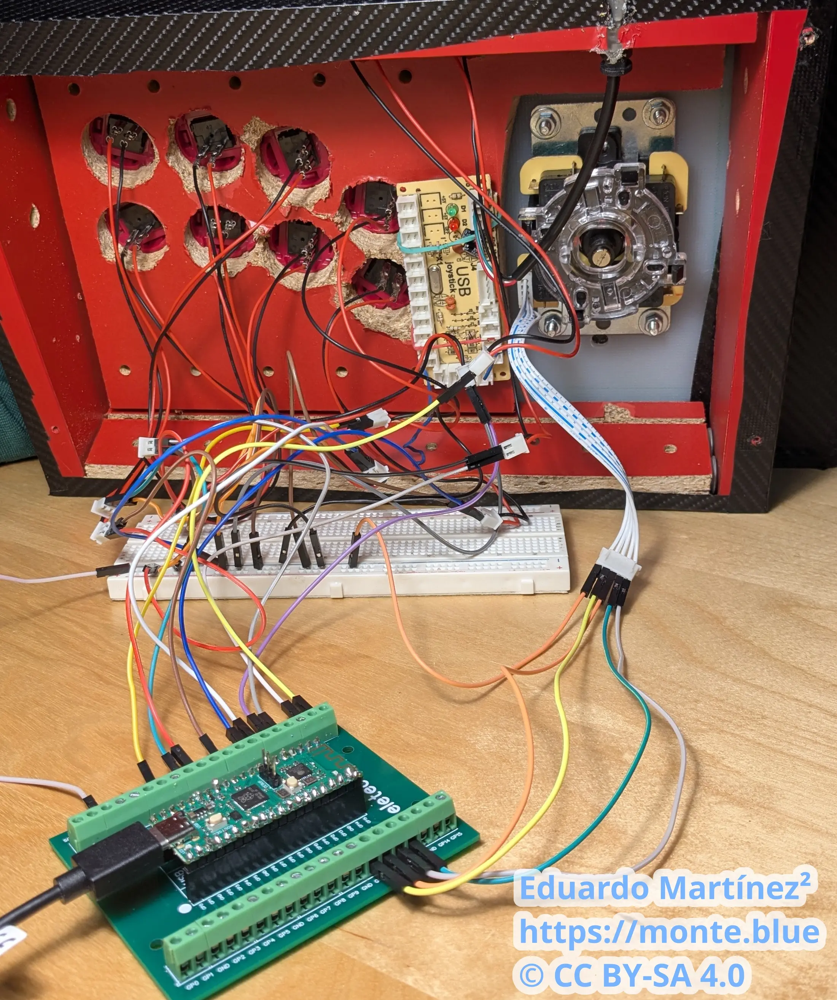

This is the write up of the initial commit of [this repository](https://codeberg.org/zagal/mando-arcade).

# A childhood desire

This project was on my wish list for really, really long. Specifically, since [this video](https://youtu.be/IJITJ1DMB8E) was released on January 11, 2013. At the time of the release, I was too young to build an arcade controller myself.


<iframe width="560" height="315" src="https://www.youtube-nocookie.com/embed/IJITJ1DMB8E?si=-dHXk7g0sRcUgjW_" title="YouTube video player" frameborder="0" allow="accelerometer; autoplay; clipboard-write; encrypted-media; gyroscope; picture-in-picture; web-share" referrerpolicy="strict-origin-when-cross-origin" allowfullscreen></iframe>


After so much time, gaining experience in embedded development, and having some spare time, I decided to materialize it.

# The arcade components

I want my arcade stick to consist of **10 buttons and one joystick**.

To build it, you need the following components:

- Buttons and the joystick, obviously.
- A case, for usage convenience.
- An encoder, to show these inputs as a peripheral for the host.

Online there are lots of resources showing how components behave. Some brands are easier to find reviews than other.

I want to highlight this [video comparing popular brands of buttons and joysticks of the sector](https://youtu.be/-2x1A4YytnM). I think the author makes a really good job.

<iframe width="560" height="315" src="https://www.youtube-nocookie.com/embed/-2x1A4YytnM?si=sswtvvm65zQmISBS" title="YouTube video player" frameborder="0" allow="accelerometer; autoplay; clipboard-write; encrypted-media; gyroscope; picture-in-picture; web-share" referrerpolicy="strict-origin-when-cross-origin" allowfullscreen></iframe>



As for the case, there are multiple DIY videos, but this one [assembling an arcade stick with clear components](https://youtu.be/Fq0rY3h4FYk) brings me memories. I miss this trend, back in the day having a clear PS2 controller was the peak of customization. Also, among the options for the case, it can even be [3D printed with a model](https://www.thingiverse.com/thing:2755015).

Honestly, this project could have been just buying the components, plugged them together and I'm done, like in [this video](https://youtu.be/nHJm_yh6q0M?si=YjFHs433h5yIqiwt).


<iframe width="560" height="315" src="https://www.youtube-nocookie.com/embed/nHJm_yh6q0M?si=K7McgsXfiThoNJJT" title="YouTube video player" frameborder="0" allow="accelerometer; autoplay; clipboard-write; encrypted-media; gyroscope; picture-in-picture; web-share" referrerpolicy="strict-origin-when-cross-origin" allowfullscreen></iframe>


But I didn't find appealing this approach now that I have some knowledge in electronics...

Where can I apply my knowledge on electronics for this project? The only part that requires software I can write is the encoder. What an encoder does can be seen in the video below.


<iframe width="560" height="315" src="https://www.youtube-nocookie.com/embed/WQh3xrT_47A?si=J5ho-QPImCsuO07r" title="YouTube video player" frameborder="0" allow="accelerometer; autoplay; clipboard-write; encrypted-media; gyroscope; picture-in-picture; web-share" referrerpolicy="strict-origin-when-cross-origin" allowfullscreen></iframe>


For this reason, I decided to write myself the software of the encoder in a microcontroller (uC). Now, I have to learn how a peripheral communicates to a host.

# Adquired knowledge on USB peripherals

To begin with, there is something called Human Interface Device (HID) which is a standard to show to the host the capabilities of the peripheral. The best resource I found so far related to this is the [Linux kernel guide on HID](https://www.kernel.org/doc/html/latest/hid/index.html).

My article is not a guide on HID, but I'll try to summarize the things I found most relevant on this.

Operating systems (OS) don't need to implement a driver for every single peripheral released since the inception of computing. With HID, most peripheral can show how they work to the host, and if it's a common kind of peripheral (keyboard, mouse, video game controller, etc.), there is no need to install drivers in the OS.

Sometimes even using HID there is some additional functionality the OS doesn't provide, so drivers might be needed, as it can be seen in this [folder in the Linux tree](https://github.com/torvalds/linux/tree/master/drivers/hid). This is out of my scope, for now, I don't expect to add any uncommon functionality to the arcade stick.

Peripherals need a way to identify themselves to the host. I assume this is to make the OS easier to find the matching driver for a specific peripheral. For this purpose, there is a Vendor ID (VID) and a Product ID (PID). When you commercialize a product, you must set each of those, so consumer's computers don't confuse one peripheral with another.

This VID is set per company, and [costs money](https://www.usb.org/getting-vendor-id), so an initial sum is required if one desires to sell peripherals; this is not my case. Also, there are [online lists of VID](https://usb-ids.gowdy.us/) to find what code belongs to who.
Thankfully, for Open Source Hardware projects, there is [one free VID](https://pid.codes/) available for those willing to follow its guidelines.

I chose VID `0x1209` from the <https://pid.codes> initiative and PID `0x0002`, which is reserved for testing purposes.

The other relevant point is how HID actually announces its capabilities to the host and sends the data. The Report Descriptor fits this purpose. It's an array of 8 bit unsigned integers that follows a specific format as defined by the USB standard. I found useful this [table with lots of common HID values](https://www.freebsddiary.org/APC/usb_hid_usages).

How hosts see a game controller? There are multiple ways depending on the platform. For example, this [open source project](https://github.com/OpenStickCommunity/GP2040-CE) advertises support for D-Input, X-Input, Nintendo Switch, Playstation 4, etc., or [this other project](https://github.com/joypad-ai/joypad-os) supports even older hardware.

So the ecosystem is kinda fragmented. I'm implementing this from zero, so for now I want to target PC. On PC, there are two standards, the old Direct Input and the new X-Input, each with their trade offs. Direct Input relies on peripherals to work over HID, and it's supported in most PC games as far as I know, and X-Input is a Microsoft solution that doesn't rely HID but it's popular because it's supposedly easier to use for desktop apps. I find this [repository](https://github.com/MysteriousJ/Joystick-Input-Examples) insightful for more information on this topic.

I decided to support the Direct Input API, because it's easier to implement from the peripheral side, it's just making a basic HID Report Descriptor for a joystick. As for X-Input, I wonder if it became popular because it actually made it easier for desktop developers or because Microsoft, its creator, pushed for it. In any case, in the future I would like to implement it as well.

# Let's build!

Now it's time to actually start designing this thing. Two choices arise first: what uC to use, and what framework to use.

The uC was an easy choice, anything that has good software support, it's cheap, and it's easy to use. Nowadays, Raspberry Pi Pico or ESP32 boards are really good. Of course there are even more options, but [RP2040](https://www.raspberrypi.com/products/rp2040/) has an ARM ISA, wireless board option and good software, so I chose that one.

And what I mean by *framework* if I'm working on embedded? Usually development orbits around the real time operating system and the languages that support it. Like FreeRTOS and the uC vendor SDK (hope I never touch this again), Zephyr and its own SDK, or even MicroPython.

Before choosing an option, I had clear one thing. This is a toy project, so I can experiment. I considered using [Zephyr](https://www.zephyrproject.org/) with either C or C++, which is new but it's getting traction in the industry, or try [Embassy](https://embassy.dev/) using Rust, not established in industry but good enough for my needs.

Even if I'm a C++ developer by trade, I enjoy writing Rust more, like [this other project I made](https://codeberg.org/zagal/custom-rss). So I decided to go with Embassy.

The point of this write up isn't explaining everything in the source code. Or teaching how Embassy works; it already has good [examples](https://github.com/embassy-rs/embassy/tree/main/examples) on how to use it with different board models. I'll focus on my process to see how to define a proper HID Report Description.

First, I want to see how an DirectInput arcade stick talks to a host. I need the USB Bus, VID and PID of the peripheral. This can be obtained via `lsusb`. I illustrate the snippets below with the peripheral I designed but it could be any other peripheral.

```txt
$ lsusb
...
Bus 003 Device 002: ID 1209:0002 Generic pid.codes Test PID
...
```

Bus `0x0003`, VID `0x1209`, PID `0x0002`. With this now I can see the HID Report Descriptor.

```txt
$ hexdump -C /sys/bus/hid/devices/0003\:1209\:0002.0001/report_descriptor
00000000  05 01 09 04 a1 01 05 01  09 01 a1 00 09 30 09 31  |.............0.1|
00000010  15 00 25 ff 75 08 95 02  81 02 c0 05 09 19 01 29  |..%.u..........)|
00000020  0a 15 00 25 01 75 01 95  0a 81 02 75 01 95 06 81  |...%.u.....u....|
00000030  03 c0                                             |..|
00000032
```

I can check the HID Reports as well. This is the actual content once the *template* of the HID Report Descriptor is reported to the host.

```txt
$ sudo usbhid-dump -m 1209:0002 -f -e stream
Starting dumping interrupt transfer stream
with 1 minute timeout.

003:002:000:STREAM             1774296324.282495
 80 80 00 00

003:002:000:STREAM             1774296324.290483
 80 80 00 00

...
```

How can I interpret all of this information easily? Thankfully, there are even [HID Report Descriptor online parsers](https://eleccelerator.com/usbdescreqparser/) that add comments for every piece of information.

```txt
0x05, 0x01, // Usage Page (Generic Desktop Ctrls)
0x09, 0x04, // Usage (Joystick)
0xA1, 0x01, // Collection (Application)
0x05, 0x01, //   Usage Page (Generic Desktop Ctrls)
0x09, 0x01, //   Usage (Pointer)
0xA1, 0x00, //   Collection (Physical)
0x09, 0x30, //     Usage (X)
0x09, 0x31, //     Usage (Y)
0x15, 0x00, //     Logical Minimum (0)
0x25, 0xFF, //     Logical Maximum (255)
0x75, 0x08, //     Report Size (8)
0x95, 0x02, //     Report Count (2)
0x81, 0x02, //     Input (Data,Var,Abs,No Wrap,Linear,Preferred State,No Null Position)
0xC0,       //   End Collection
0x05, 0x09, //   Usage Page (Button)
0x19, 0x01, //   Usage Minimum (1)
0x29, 0x0A, //   Usage Maximum (10)
0x15, 0x00, //   Logical Minimum (0)
0x25, 0x01, //   Logical Maximum (1)
0x75, 0x01, //   Report Size (1)
0x95, 0x0A, //   Report Count (10)
0x81, 0x02, //   Input (Data,Var,Abs,No Wrap,Linear,Preferred State,No Null Position)
0x75, 0x01, //   Report Size (1)
0x95, 0x06, //   Report Count (6)
0x81, 0x03, //   Input (Const,Var,Abs,No Wrap,Linear,Preferred State,No Null Position)
0xC0,       // End Collection
```

We can see there are 10 buttons, 1 bit for each, that can be pressed or not. There are also two axis, each of 8 bits, that range from values `0x00` to `0xFF`. About the axis, an arcade joystick consist of 4 buttons that mimics the direction where the lever is pushed. So technically there is no need for 8 bits for each axis when each button of the joystick could be shown as pressed or not. The problem here is modern applications and videogames expect a joystick to be two axis, not buttons. We can trick this by just returning the values `0x00` for one edge of the axis, `0xFF` for the other edge of the same axis, and `0x80` to represent no action in the axis.

One last thing, because it adds up to `8 * 2 + 1 * 10 = 26 bits`, it requires 6 additional bits for alignment to a whole byte.

I arrived at the layout you see after trial and error, reading the HID Report Descriptor from multiple controllers and asking AI. It took me a week because most controller announce even capabilities it doesn't have, and replicating them led to my Linux host not recognizing my layout. For example, I dumped the content of an AliExpress arcade encoder, and it announced two joysticks when it only offers one, so the second one was set with constants. What worked for me at the end was just to describe what I want, 2 axis for one joystick and 10 buttons, and it worked perfectly.

Defining the HID Report Descriptor is really the tricky part about this. The rest of the code consists of setting up the communication to the host, reducing the latency between reports to the minimum, and sending an HID Report that correctly fits the description.

Once we have a working controller, it can be tested in multiple ways, either in a videogame, or the OS settings, or even with HTML tester like [this one](https://joypad.ai/) or [this one](https://greggman.github.io/html5-gamepad-test/).

# Some notes on Rust for embedded

This last task, fitting the description, can be done in C++ with [bit-field packing of class data members](https://en.cppreference.com/w/cpp/language/bit_field.html) and casting the struct to a simple memory address, so when sent it reinterprets the data in the order stated in the struct. There is no explicit control of endianness, but it does the work if you are careful.

In Rust I didn't find a native way to define bit fields, and such casting would likely be forbidden for memory safety reasons, though I'm not 100 % sure of these last two statements. Anyway, I decided to rely on an external crate. I tried three:

- [packed_struct](https://crates.io/crates/packed_struct): this allows for explicit endianness within struct fields. It also allows for arbitrary length integers. I didn't use this one because it doesn't offer a [fluent interface](https://en.wikipedia.org/wiki/Fluent_interface) for the fields or the ability to choose endianness when turning the struct into an array when I want to send the information.
- [modular-bitfiled](https://crates.io/crates/modular-bitfield): less verbose than the previous one and with fluent interface, but without the ability to set the endianness, either within the struct or when generating the array. This is a big no.
- [bitfield-struct](https://crates.io/crates/bitfield-struct): it combines all the features I mentioned before, plus checks that the expected size I want, say 32 bits, actually matches what I fill inside the struct. I chose this one.

Other than that, Cargo is such a nice tool, even for cross compiling to embedded devices, and for this toy project, the Embassy ecosystem worked nicely. I would like to test it in a more realistic project to see whether something is lacking for now.

# Let's play!



Finally I wrote my basic encoder. Is it better than any of the other open source solutions that work for the RP2040? For now, absolutely not.

But there is [a quote](https://www.goodreads.com/quotes/282264-it-is-the-time-you-have-wasted-for-your-rose) I like from *The Little Prince* that can apply here as well:

> It is the time you have wasted for your rose that makes your rose so important.

I think the author of this book was talking about personal relationships, not an encoder of an arcade stick...

I love it anyway, my silly and little functional piece of code.
